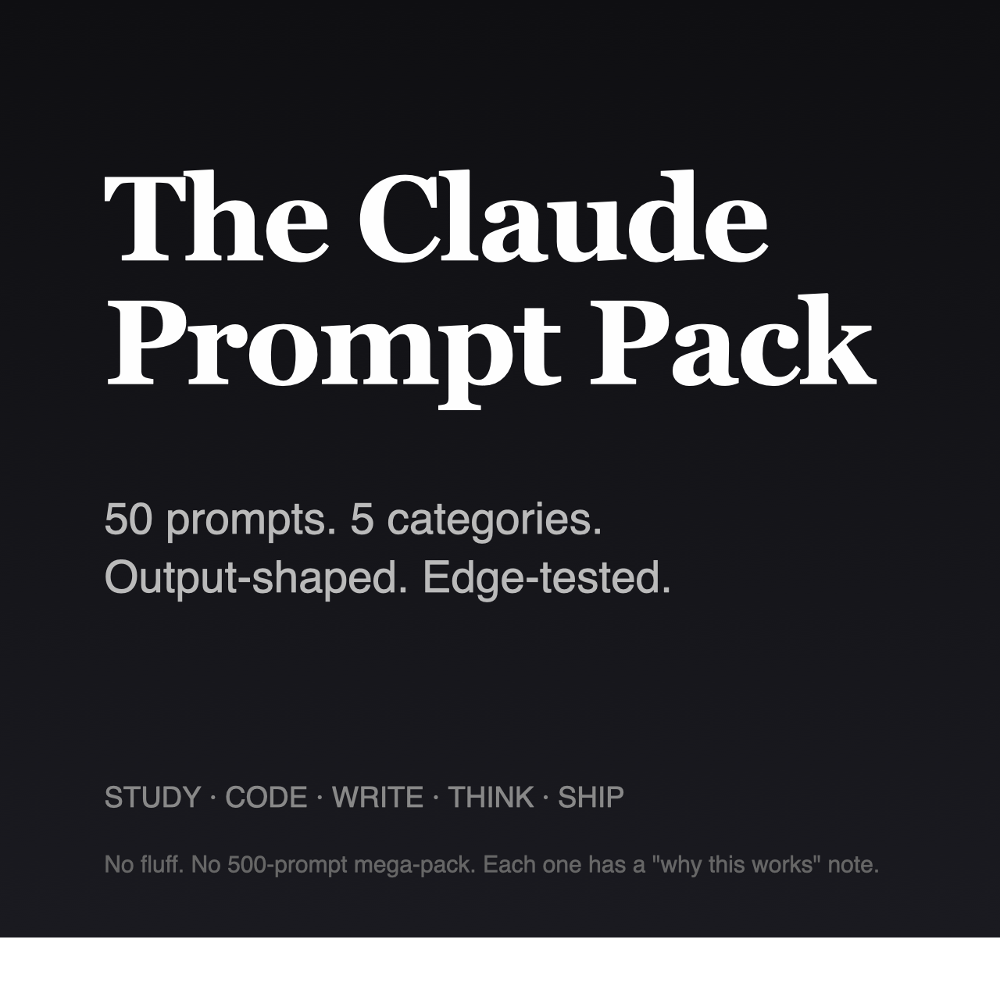

# The Claude Prompt Pack

> 50 hand-engineered Claude prompts for students, indie hackers, and self-taught builders. Output-shaped. Edge-tested. Each prompt comes with a "why this works" note.

**Buy on Gumroad: https://cwanster8.gumroad.com/l/umfabr** — NZ$19, instant download.

## What this is

A curated set of 50 prompts for Claude (Anthropic's AI assistant), organized into five categories:

- **STUDY** — textbook compression, Anki card generation, essay critique, paper triage, pre-exam blind-spot finder
- **CODE** — senior-engineer code review, hypothesis-driven bug debugging, refactor with justification, naming gauntlet, API design review
- **WRITE** — voice-preserving tightener, AI-smell remover, cold outreach drafter, opening-line workshop, paragraph-level audit
- **THINK** — pre-mortems, calibration checks, 20/80 finders, status-quo bias audits, "name the mechanism" reasoning
- **SHIP** — 30-minute product validation, MVP scope-cutting, backlog triage, launch tweets, post-launch retrospectives

Every prompt is engineered with a specific output format (JSON, markdown table, structured sections) so you can build on the result instead of cleaning it up. Each one was tested on real inputs before inclusion — prompts that didn't beat a one-line baseline were cut.

## Who buys this

- Students using Claude for studying who want to skip the trial-and-error
- Indie hackers using Claude for code review, launch copy, product validation
- Self-taught builders who already know Claude is powerful but want a curated starting set
- Anyone who's spent hours hand-crafting prompts and knows that the gap between mediocre and great is enormous

## Why pay if the link is here

The download URL below is public. The zip is password-protected, and the password is on the [Gumroad page](https://cwanster8.gumroad.com/l/umfabr). Buying is the way to support the work and get the convenience of a single zip.

If you'd rather take it free, you can. If you'd rather pay and have me make more like this, please do.

## Download

The encrypted zip lives in the [latest release](https://github.com/kingsleywang1984/claude-prompt-pack-delivery/releases/latest). Direct link: [claude-prompt-pack.zip](https://github.com/kingsleywang1984/claude-prompt-pack-delivery/releases/download/v1.0.0/claude-prompt-pack.zip).

The zip is password-protected. The password is on the Gumroad product page: https://cwanster8.gumroad.com/l/umfabr

## License

The pack is licensed for personal and commercial use. You can't resell it as a prompt pack itself, but you can use the prompts in any work you do — your projects, client work, products you ship, courses you teach.

## Tags

`claude-ai` `anthropic` `prompts` `prompt-engineering` `ai-prompts` `claude-prompts` `chatgpt-alternative` `productivity` `indie-hackers` `students` `learning` `digital-product`
